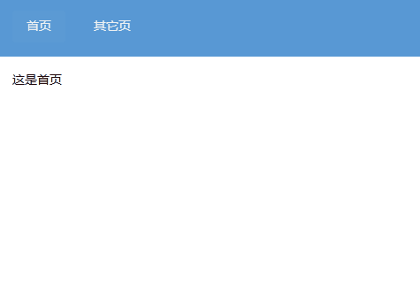
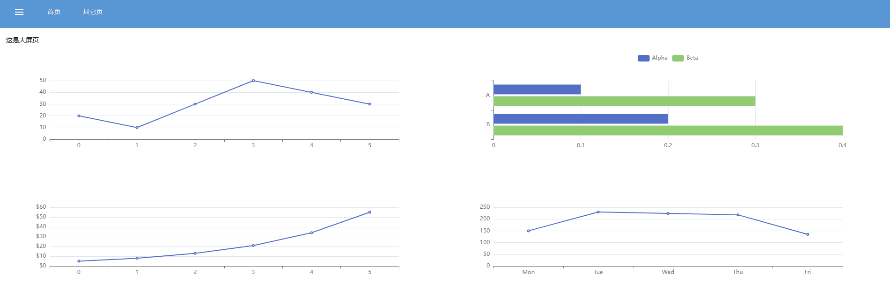
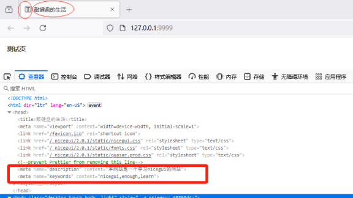
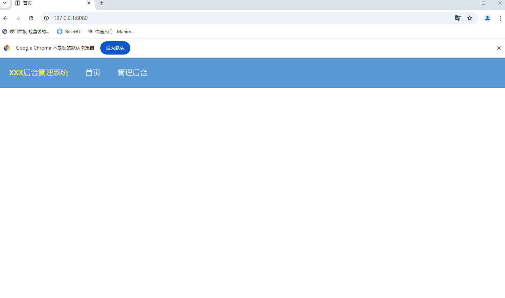
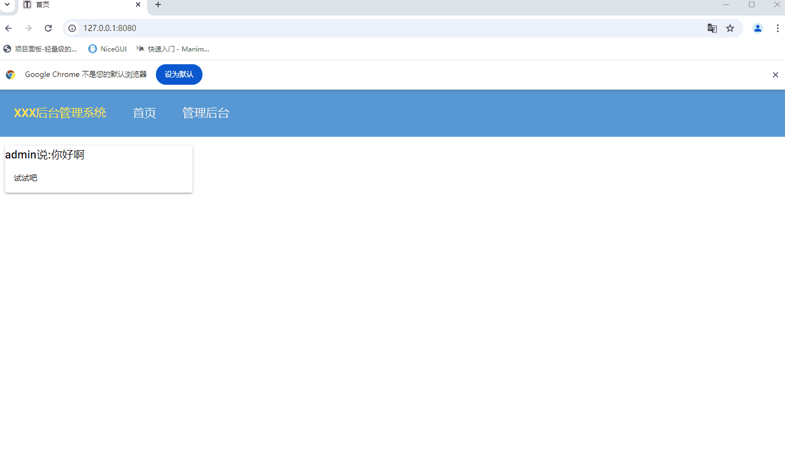
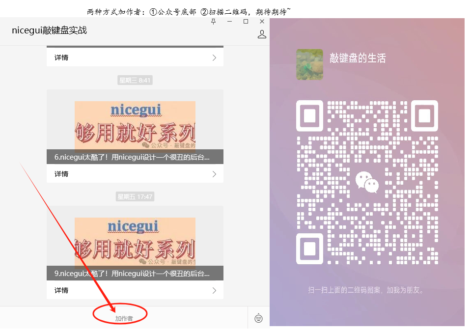

# nicegui-enough 争取做nicegui最有用的中文入门教程

配合公众号“nicegui敲键盘实战”（原名“敲键盘的生活”）系列文章“nicegui 够用就好系列”

相关源码样例(逐步建设中)

## 01导航栏效果

## 02侧边栏效果

## 03网页基础信息

## 04登录页面

## 05后台管理系统

- 阅读原文请关注公众号，[nicegui 够用就好系列”](https://mp.weixin.qq.com/mp/appmsgalbum?__biz=Mzg5NjQzNTg5OA==&action=getalbum&album_id=3621183102564827145#wechat_redirect)

  
- 建立了“NiceGUI交流群”，欢迎扫码入群，共同学习交流
  
- 也可以加作者共同学习
  
- 图片都是代码运行的GIF，如果看不见，可以访问[码云](https://gitee.com/thekingofhero/nicegui-enough)的仓库地址
